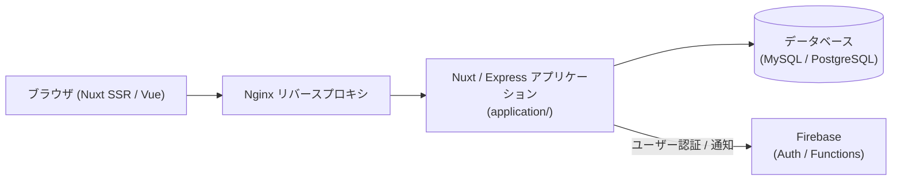

# no1-company-share

各業界・市場におけるトップシェア企業のデータや業界情報を投稿・共有できる Web アプリケーションです。  
Nuxt.js による SSR フロントエンドと Express API、Firebase Functions、リレーショナルデータベースを組み合わせて構築されています。

---

## 主な機能

- **業界・企業シェアの可視化**: 業界ごとのトップ企業シェア情報の一覧・詳細表示。
- **データ投稿・編集**: ユーザーによる新規シェア情報や企業データの登録・更新。
- **認証連携**: Firebase Authentication を用いたセキュアなログイン・ユーザー管理（SSR セッション検証対応）。

---

## システム構成



---

## 技術スタック

- **フロントエンド / サーバー**: Nuxt.js (Vue.js), Express, TypeScript, Node.js 24
- **バックエンド機能**: Firebase Functions (Node.js 22), Firebase Authentication
- **データベース**: MySQL / PostgreSQL
- **開発・インフラ**: Docker, Docker Compose, Nginx

---

## 開発環境のセットアップ

Docker Compose を利用して、アプリケーション・データベース・Web サーバを一括で起動できます。

### 1. 依存パッケージのインストール

```bash
# アプリケーション層の依存関係
cd application
yarn install

# Functions層の依存関係（必要に応じて）
cd ../functions/functions
npm ci
cd ../../
```

### 2. コンテナの起動

プロジェクトルートで Docker Compose を起動します。

```bash
docker compose up
```

起動後、ローカル環境で画面および API にアクセスできます。

---

## 主なコマンド

```bash
# アプリケーションのテスト・静的解析
cd application
yarn test
yarn lint
yarn build

# Firebase Functions のテスト・静的解析
cd functions/functions
npm test
npm run lint
```

---

## ディレクトリ構成

```text
no1-company-share/
├── application/             # Nuxt.js / Express Web アプリケーション
│   ├── front/               # Vue コンポーネント、Vuex ストア、静的アセット
│   ├── server/              # Express API サーバ、SSR 認証ロジック
│   └── common/              # 共通型定義・ユーティリティ
├── functions/               # Firebase Functions（サーバーレスバックエンド）
├── database/                # DB 初期化スクリプトおよびマイグレーション
├── web/                     # Nginx の配信設定
└── docker-compose.yml       # 開発用マルチコンテナ設定
```
